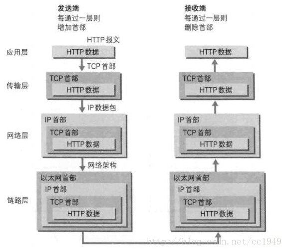

# 网络基础

## OSI七层协议模型

OSI七层协议模型，主要是：应用层（Application）、表示层（Presentation）、会话层（Session）、传输层（Transport）、网络层（Network）、数据链路层（Data Link）、物理层（Physical）。

| OSI 模型   | 主要协议                  | 单位   |
| ---------- | ------------------------- | ------ |
| 应用层     | Telnet、FTP、HTTP、SNMP等 | 数据流 |
| 表示层     | CSS GIF HTML JSON XML GIF | 数据流 |
| 会话层     | FTP SSH TLS HTTP(S) SQL   | 数据流 |
| 传输层     | TCP UDP                   | 数据段 |
| 网络层     | IP(IPV4、IPV6) ICMP       | 数据包 |
| 数据链路层 | 802.2、802.3ATM、HDLC、   | 帧     |
| 物理层     | V.35、EIA/TIA-232         | 比特流 |

| 结构名     | 功能                                                         | 主要设备                            |
| ---------- | ------------------------------------------------------------ | ----------------------------------- |
| 应用层     | 确定通信对象，提供访问网络服务的接口                         | 网关                                |
| 表示层     | 负责数据的编码、转化（界面与二进制数据转换，高级语言与机器语言的转换）数据压缩、解压，加密、解密。根据不同应用目的处理为不同的格式，表现出来就是我们看到的各种各样的文件扩展名。 | 网关                                |
| 会话层     | 负责建立、维护、控制会话单工(Simplex)、半双工(Half duplex)、全双工(Full duplex)三种通信模式的服务 | 网关                                |
| 传输层     | 负责分割、组合数据，实现端到端的逻辑连接三次握手(Three-way handshake)，面向连接(Connection-Oriented)或非面向连接(Connectionless-Oriented)的服务，流控(Flow control)等都发生在这一层。是第一个端到端，即主机到主机的层次。 | 网关                                |
| 网络层     | 负责管理网络地址，定位设备，决定路由                         | 路由器，网桥路由器                  |
| 数据链路层 | 负责准备物理传输，CRC校验，错误通知，网络拓扑，流控等        | 交换机、网桥、网卡                  |
| 物理层     | 就是实实在在的物理链路，负责将数据以比特流的方式发送、接收   | 集线器、中继器,电缆，发送器，接收器 |

## 四层模型

4层是指TCP/IP四层模型，主要包括：应用层、运输层、网际层和网络接口层

## TCP协议

TCP位于传输层， 提供可靠的字节流服务。所谓的字节流服务（Byte Stream Service） 是指， 为了方便传输， 将大块数据分割成以报文段（segment） 为单位的数据包进行管理。 而可靠的传输服务是指， 能够把数据准确可靠地传给对方。 即TCP 协议为了更容易传送大数据才把数据分割， 而且 TCP 协议能够确认数据最终是否送达到对方。所以，TCP连接相当于两根管道（一个用于服务器到客户端，一个用于客户端到服务器），管道里面数据传输是通过字节码传输，传输是有序的，每个字节都是一个一个来传输。

(1)、三次握手：握手过程中使用了 TCP 的标志（flag） —— SYN（synchronize） 和ACK（acknowledgement） 。

第一次握手：建立连接时，客户端A发送SYN包（SYN=j）到服务器B，并进入SYN_SEND状态，等待服务器B确认。
第二次握手：服务器B收到SYN包，必须确认客户A的SYN（ACK=j+1），同时自己也发送一个SYN包（SYN=k），即SYN+ACK包，此时服务器B进入SYN_RECV状态。
第三次握手：客户端A收到服务器B的SYN＋ACK包，向服务器B发送确认包ACK（ACK=k+1），此包发送完毕，完成三次握手。

若在握手过程中某个阶段莫名中断， TCP 协议会再次以相同的顺序发送相同的数据包。
 （2）、四次挥手：由于TCP连接是全双工的，因此每个方向都必须单独进行关闭。这个原则是当一方完成它的数据发送任务后就能发送一个FIN来终止这个方向的连接。收到一个 FIN只意味着这一方向上没有数据流动，一个TCP连接在收到一个FIN后仍能发送数据。先进行关闭的一方将执行主动关闭，而另一方被动关闭。

客户端A发送一个FIN，用来关闭客户A到服务器B的数据传送。
服务器B收到这个FIN，它发回一个ACK，确认序号为收到的序号加1。
服务器B关闭与客户端A的连接，发送一个FIN给客户端A。
客户端A发回ACK报文确认，并将确认序号设置为收到序号加1。
三次握手和四次挥手：在TCP连接中，服务器端的SYN和ACK向客户端发送是一次性发送的，而在断开连接的过程中， B端向A
端发送的ACK和FIN是分两次发送的。因为在B端接收到A端的FIN后， B端可能还有数据要传输，所以先发送ACK，等B端处理完自己的事情后就可以发送FIN断开连接了。

## UDP协议

无连接协议，也称透明协议，也位于传输层。

形象的理解，TCP协议像打电话，UDP协议像发短信

