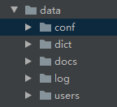

# FTP作业

## 作业要求

1. 用户加密认证
2. 允许同时多用户登录
3. 每个用户有自己的家目录 ，且只能访问自己的家目录
4. 对用户进行磁盘配额，每个用户的可用空间不同
5. 允许用户在ftp server上随意切换目录
6. 允许用户查看当前目录下文件
7. 允许上传和下载文件，保证文件一致性
8. 文件传输过程中显示进度条
9. 可以删除文件
10. 附加功能：支持文件的断点续传

## FTP流程图


## 目录结构


## 服务器端

服务器端主要是处于长期运行监控状态。在调用启动之后，即无需再次操作。

**bin文件夹**：主要是放置的服务器启动文件，运行该文件夹下的 start.py 即可启动服务器

```python
import os
import sys
import socketserver
base_path = os.path.dirname(os.path.dirname(os.path.abspath(__file__)))
sys.path.append(base_path)


from data.conf.configure import Host,Port
from core.heart import MyTCPHandler

if __name__ == '__main__':
    try:
        server = socketserver.ThreadingTCPServer((Host, Port), MyTCPHandler)
        print("Server is Running".center(50, "-"))
        print("Server地址：%s，端口号：%s".center(32, " ") % (Host, Port))
        server.serve_forever()
    except:
        print("当前server所需端口已被占用,请检查！")
```

**core文件夹**：主要存放服务器程序的核心部分，涉及文件的作用如下：

- heart.py  主要是服务器与终端的连接方式设定，内部设有相应功能模块

```python
import os
import sys
import json
import time
import timer
import shutil
import hashlib
import logging
import socketserver

base_dir = os.path.dirname(os.path.dirname(os.path.abspath(__file__)))
sys.path.append(base_dir)

from core.record import record
from data.conf.configure import HomeDocs, username, password
from data.dict.dict import Stand_msg

'''
# 拼接文件日志，格式为 %Y-%m-%d.txt
'''
timer = time.strftime("%Y-%m-%d")
logger = record(base_dir + "\\data\\log\\" + timer + ".txt")

class MyTCPHandler(socketserver.BaseRequestHandler):
    '''
    # 解析连接请求参数
    '''
    def setup(self):
        auth_msg_source = self.request.recv(1024).strip()
        self.auth_msg = json.loads(auth_msg_source)
        if(self.auth_msg.get('type')) == 'auth':
            self.username = self.auth_msg['username']
            self.md5_password = self.auth_msg['password']
            self.ipaddr = self.auth_msg['ipaddr']
            self.role = self.auth_msg['auth_tag']
            logger.info("用户名: %s尝试从终端 %s 登录服务器"%(self.username, self.ipaddr))

    '''
    # 处理连接
    '''
    def handle(self):
        if self.auth_msg.get('type') == 'auth':
            auth_tag = self.__auth()
            if auth_tag==101:
                logger.info("用户 %s 从终端 %s 登录成功！"%(self.username,self.ipaddr))
                #此处定义的是当前登录用户的目标文件夹，此处也是函数self.dest初始化的位置
                self.dest=HomeDocs+"\\"+self.username
                ##########此处执行的动作是创建以用户名命名的文件夹，防止后续操作出现问题###############
                dirs=self.dest.split("\\")
                res_item=""
                for item in  dirs:
                    res_item=res_item+item+"\\"
                    if os.path.exists(res_item):
                        pass
                    else:
                        os.mkdir(res_item)
                ###################读取当前用户的空间使用值#############################################
                with open(base_dir+"\\data\\users\\Quota.txt","r") as f_qtread:
                    for qt in f_qtread:
                        qtusr,qtvl=qt.strip("\n").strip('"').split(":")
                        if qtusr==self.username:
                            self.qtvl=qtvl
                            self.qtvl=int(self.qtvl)*1024*1024
                            break
                ####################读取当前用户名下的文件大小###########################################
                self.allsize=0
                for size_path,size_dirs,size_files in os.walk(HomeDocs+"\\"+self.username):
                    for  item in size_files:
                        self.allsize=self.allsize+int(os.path.getsize(os.path.join(size_path,item)))
                self.__changemsg()
            elif auth_tag==102:
                logger.error("用户名 %s 未注册。"%self.username)
            elif auth_tag==100:
                logger.error("用户登录失败，用户名或密码发送错误。")

    '''
    # 服务端用户加密认证
    '''
    def __auth(self):
        if self.role == 'ordinary': # 普通用户身份登录
            auth_tag=False
            if os.path.exists(base_dir+"\\data\\users\\UserAuth.txt"):
                with open(base_dir+"\\data\\users\\UserAuth.txt","r") as f_read:
                    for line in f_read:
                        usr,pad=line.strip('\n').strip('"').split(":")
                        if usr==self.username and pad ==self.md5_password:
                            auth_tag=True
                            self.__sendmsg(101)
                            return 101
                if auth_tag==False:
                    self.__sendmsg(100)
                    return 100
            else:
                self.__sendmsg(102)
                return 102
        elif self.role == 'mgr': # 管理员身份登录
            m = hashlib.md5(password.encode('utf-8'))
            passwd_value = m.hexdigest()
            if self.username == username and self.md5_password == passwd_value:
                self.__sendmsg(101, data = 'True')
                logger.info("用户 %s 从终端 %s 登录成功！" % (self.username, self.ipaddr))
                try:
                    self.__mgr()
                except:
                    logger.info("%s的管理员已断开连接。" % self.ipaddr)
            else:
                self.__sendmsg(100)

    '''
    # 发送处理结果给请求端
    '''
    def __sendmsg(self, stand_code, data=None):
        sendmsg = {
            'standcode':stand_code,
            'standmsg':Stand_msg[stand_code],
            'data':data
        }
        self.request.send(json.dumps(sendmsg).encode())

    '''
    # 此为管理员相关功能的函数，不涉及FTP自身的功能
    '''
    def __mgr(self):
        '''
        此为管理员相关功能的函数，不涉及FTP自身的功能
        :return:
        '''
        while True:
            msg='''
                    1.注册用户
                    2.删除用户
                    3.查看用户
                    4.修改配额
                    5.退出
                    '''
            self.__sendmsg(102,data=msg)
            ret_msg=self.__recvmsg()
            if ret_msg=="1" or ret_msg=="注册用户":

                wr_tag=False
                self.__sendmsg(400)#此处是为了让客户端知道下一步应该做什么，发送400 是为了让客户端进入到注册用户的界面
                sign_msg=self.__recvmsg()
                username=sign_msg.get("username")
                password=sign_msg.get("password")
                quotavalue=sign_msg.get("quotavalue")
                if os.path.exists(base_dir+"\\data\\users\\UserAuth.txt"):
                    with open(base_dir+"\\data\\users\\UserAuth.txt","r") as f_read:
                        for line in f_read:
                            usr,pad=line.strip('"').split(":")
                            if usr==username:
                                wr_tag=True
                if wr_tag==False:
                    joindir=""
                    #此处是为了预防初次操作不存在当前目录#####################
                    dirs=(base_dir+"\\data\\users\\UserAuth.txt").split("\\")
                    for i  in  range(0,len(dirs)):
                        if len(dirs)==i+1:
                            break
                        joindir=joindir+dirs[i]+"\\"
                        if os.path.exists(joindir):
                            continue
                        else:
                            os.mkdir(joindir)
                    #############################################################
                    #将用户名密码写入userauth.txt文件
                    with open(base_dir+"\\data\\users\\UserAuth.txt","a") as f:
                        f.write(json.dumps(str(username)+":"+str(password)))
                        f.write("\n")
                    #将配额值写入配额文件
                    with open(base_dir+"\\data\\users\\Quota.txt","a") as f_quota:
                        f_quota.write(json.dumps(str(username)+":"+str(quotavalue)))
                        f_quota.write("\n")
                    logging.info("管理员注册账号成功，账号名：%s，用户默认空间限额：%s"%(username,quotavalue))
                    self.__sendmsg(403)#成功
                else:#此处失败主要是因为存在相同的用户名
                    logging.error("管理员注册账号失败，账号名：%s"%username)
                    self.__sendmsg(404)#失败
                continue
            elif ret_msg=="2" or ret_msg=="删除用户":
                user_list=[]#删除用户名使用的列表
                quota_list=[]#删除配额使用的列表
                del_tag=False#表示是否需要删除用户的tag
                quota_tag=False#表示是否需要删除配额值的tag
                self.__sendmsg(405)
                del_username=self.__recvmsg()#接收需要删除的用户名
                if os.path.exists(base_dir+"\\data\\users\\UserAuth.txt"):
                    with open(base_dir+"\\data\\users\\UserAuth.txt","r") as f_delete:
                        #判断是否需要进行删除动作，若需要删除，则del_tag为True
                        for line in f_delete:
                            delusr,delpad=line.strip('"').split(":")
                            if delusr==del_username:
                                del_tag=True
                                continue
                            else:
                                user_list.append(line)
                    #判断配额值是否需要删除，若需要删除，则quota_tag为True
                    if os.path.exists(base_dir+"\\data\\users\\Quota.txt"):
                        with open(base_dir+"\\data\\users\\Quota.txt","r") as f_delquota:
                            for line2 in f_delquota:
                                delusr,delquo=line2.strip('"').split(":")
                                if delusr==del_username:
                                    quota_tag=True
                                    continue
                                else:
                                    quota_list.append(line2)
                    if del_tag and quota_tag:
                        with open(base_dir+"\\data\\users\\UserAuth.txt","w") as f_rewr:
                            for item in user_list:
                                f_rewr.write(item)
                            logging.info("完成删除用户%s"%delusr)
                        with open(base_dir+"\\data\\users\\Quota.txt","w") as f_requota:
                            for item in quota_list:
                                f_requota.write(item)
                            logging.info("完成删除用户%s磁盘配额"%delusr)
                        self.__sendmsg(401)
                    elif quota_tag==False:
                        logger.info("删除用户%s磁盘配额失败"%delusr)
                        self.__sendmsg(408)
                    else:
                        logger.error("删除用户%s失败,当前用户未注册"%delusr)
                        self.__sendmsg(402)
                else:
                    logger.info("删除用户%s失败,当前用户文件不存在"%del_username)
                    self.__sendmsg(413)
            elif ret_msg=="3" or ret_msg=="查看用户":
                seek_list=[]
                if os.path.exists(base_dir+"\\data\\users\\Quota.txt"):
                    with open(base_dir+"\\data\\users\\Quota.txt","r") as f_seek:
                        #此处发送给客户端的信息主要是配额文件内的信息
                        #格式为：  用户名：配额值
                        for line in f_seek:
                            seek_list.append(line)
                    self.__sendmsg(407,data=seek_list)

                else:
                    self.__sendmsg(407)
                logging.info("管理员查询了用户信息")
            elif ret_msg=="4" or ret_msg=="修改配额":
                self.__sendmsg(410)
                quota_msg=self.__recvmsg()
                cgqt_list=[]
                qt_value=False
                quota_name=quota_msg.get("name")
                cgqt_value=quota_msg.get("value")
                if os.path.exists(base_dir+"\\data\\users\\Quota.txt"):
                    with open(base_dir+"\\data\\users\\Quota.txt","r") as f_cgvalue:
                        for line in f_cgvalue:
                            qtname,qtvalue=line.strip("\n").strip('"').split(":")
                            if qtname==quota_name:
                                qt_value=True
                                qtline=str(qtname)+":"+str(cgqt_value)
                                cgqt_list.append(qtline)
                                continue
                            else:
                                cgqt_list.append(line.strip("\n").strip('"'))
                    if qt_value:
                        with open(base_dir+"\\data\\users\\Quota.txt","w") as f_cgvalue_write:
                            for i in range(0,len(cgqt_list)):
                                f_cgvalue_write.write('"'+cgqt_list[i]+'"')
                                f_cgvalue_write.write("\n")
                        self.__sendmsg(411)
                        logger.info("管理员修改了用户%s的配额值！"%quota_name)
                    else:
                        self.__sendmsg(412)
                        logger.info("修改配额值失败，当前要修改的用户%s不存在"%quota_name)
                else:
                    self.__sendmsg(412)
                    logger.info("修改配额值失败，当前配额文件不存在")
            elif ret_msg=="5" or ret_msg=="退出":
                self.__sendmsg(406)
                logger.info("管理员已退出")

            else:
                #103没有特殊含义，仅仅是因为其未分配提示词
                self.__sendmsg(103)
                continue
    #结束连接时
    def finish(self):
        logger.info("%s与服务器连接结束。"%self.ipaddr)
        logger.info("=============================================================")

    '''
    # 服务端接受客户端发送过来数据的
    '''
    def __recvmsg(self):
        Rsg_source=self.request.recv(1024)
        Rsg=json.loads(Rsg_source.decode())
        return Rsg


    def __changemsg(self):
        '''
        此函数为登录成功后客户端与服务器相互交互的函数，客户端发送相关指令给服务器，服务器根据指令分配相应函数完成。
        :return:
        '''
        while True:
            try:
                self.chmsg=self.__recvmsg()
                if self.chmsg.get("Type")=="pwd":
                    #运行pwd函数
                    self.__pwd()
                elif self.chmsg.get("Type")=="cd":
                    self.__cd()
                elif self.chmsg.get("Type")=="ls":
                    self.__ls()
                elif self.chmsg.get("Type")=="put":
                    self.__put()
                elif self.chmsg.get("Type")=="get":
                    self.__get()
                elif self.chmsg.get("Type")=="mkdir":
                    self.__mkdir()
                elif self.chmsg.get("Type")=="rm":
                    self.__rm()
                elif self.chmsg.get("Type")=="bye":
                    self.__bye()
                else:
                    self.__help()
            except:
                logger.info("客户端%s已断开连接"%self.ipaddr)
                break

    def __ls(self):
        '''
        #此处为遍历当前目录下所有的文件夹和文件，然后返回。
        #若当前目录为空，则不会返回data数据，客户端可据此进行判断“当前目录为空”
        :return:
        '''
        ls_send_list=[]
        if self.chmsg.get("Type") is not None:
            ls_send_list=self.__walk()
            logger.info("用户%s遍历了目录,目录名为%s"%(self.username,self.dest.strip("").split("\\")[-1]))
        self.__sendmsg(103,data=ls_send_list)

    def __walk(self):
        '''
        #此处遍历当前目录，找出所在文件夹的子文件夹和文件列表，并返回相应的列表，格式为  [[文件夹列表]，[文件列表]]
        :return: 返回的是当前文件夹下存在的文件夹名和文件名的列表
        '''
        c=0
        search_list=[]
        ls_list=os.walk(self.dest)
        for item in ls_list:
            for item2 in item:
                if c==0:
                    c+=1
                    continue
                search_list.append(item2)
            if c==1:
                break
        return search_list

    def __cd(self):
        '''
        #执行目录切换动作的函数
        :return:
        '''
        if self.chmsg.get("Type") is not None:
            dest=self.chmsg["dest"]
            #将全局的self.dest赋值到本函数内的this_dest,确保调用。
            this_dest=self.dest
            # this_tag=False
            #此处只是获取search_walk返回的文件夹列表##
            floder_list=(self.__walk())#[0]
            file_list=floder_list[0]
            ###########################################
            if dest in file_list:
                self.dest=this_dest+"\\"+dest
                self.__sendmsg(109)
                logger.info("用户%s已将目录切换至%s"%(self.username,self.dest))
            #若使用“..”进行文件夹切换，可返回至上层目录。
            #此处会进行判断是否切换的目录超过权限，若超过，则维持原目录，即最高可切换至以用户名命名的文件夹。
            elif dest=="..":
                #如果切换越权，维持原目录
                if self.dest==HomeDocs+"\\"+self.username+"\\" or self.username not in self.dest.split("\\"):
                    self.dest=HomeDocs+"\\"+self.username
                    logger.error("用户%s指定切换的目录越权，无法完成切换。"%self.username)
                    self.__sendmsg(111)
                #如果没有越权，则执行切换，将字符串切割以后舍弃最后一个。
                # elif HomeDocs+"\\"+self.username in self.dest:
                else:
                    dest_list=self.dest.split("\\")
                    new_dest=""
                    for i in range(0,len(dest_list)):
                        if len(dest_list)==i+1:
                            break
                        new_dest=new_dest+dest_list[i]+"\\"
                    #执行完成切换以后，将已经变动的当前文件路径重新赋值给全局的self.dest，算是告知所有协同工作的函数
                    self.dest=new_dest.strip("\\")
                    logger.info("用户%s切换目录至上一级%s"%(self.username,self.dest))
                    self.__sendmsg(110)
            else:
                logger.error("用户%s切换目录至%s失败，服务器不存在此目录"%(self.username,dest))
                self.__sendmsg(108)

    def __pwd(self):
        '''
        #此为查看当前所在位置的函数
        :return:
        '''
        send_list=""
        send_tag=False
        if self.chmsg.get("Type") is not None:
            dest_list=self.dest.split("\\")
            for item in dest_list:
                if item!="":
                    if item==self.username:
                        send_tag=True
                    if send_tag==True:
                        send_list=send_list+item+"\\"
            logger.info("用户：%s查询了当前所在目录：%s"%(self.username,send_list))
            self.__sendmsg(103,data=send_list)


    def __mkdir(self):
        '''
        #此为执行创建目录的函数
        :return:
        '''
        if self.chmsg.get("Type") is not None:
            mkname=self.chmsg.get("mkname")
            if os.path.exists(self.dest+"\\"+mkname):
                logger.error("指定创建的目录已存在，无法创建")
                self.__sendmsg(112)
            else:
                #在创建目录的过程中，此处判断是否存在路径上没有的目录，若目录上没有，则会一块创建。
                dirs=self.dest.split("\\")
                dirs.append(mkname)
                res_item=""
                for item in  dirs:
                    res_item=res_item+item+"\\"
                    if os.path.exists(res_item):
                        pass
                    else:
                        os.mkdir(res_item)
                self.__sendmsg(113)
                logger.info("用户%s创建文件夹%s成功"%(self.username,self.chmsg.get("mkname")))


    def __rm(self):
        '''
        #此为执行移除文件或者文件夹的函数
        #需要判断移除的是文件还是文件夹，第一遍循环的是文件夹，第二遍循环的是文件
        #在删除文件夹的时候，若文件夹内有文件，使用os.rmdir()无法移除文件夹，会直接报错
        #使用shutil.rmtree则可以直接全部删除
        :return:
        '''
        if self.chmsg.get("Type") is not None:
            c=0
            tag=False
            rmname=self.chmsg.get("rmname")
            file_list=self.__walk()
            for item in file_list:
                if rmname in item and c==0:
                    if os.path.exists(self.dest+"\\"+rmname):
                        try:
                            shutil.rmtree(self.dest+"\\"+rmname)
                            logger.info("文件夹%s已被用户%s删除"%(rmname,self.username))
                            self.__sendmsg(114)
                        except:
                            logger.error("文件夹%s删除异常，未能成功处理"%rmname)
                            self.__sendmsg(118)
                    else:
                        logger.error("指定删除的文件夹不存在，无法完成删除")
                        self.__sendmsg(115)
                    tag=True
                #在循环第一遍的时候，因为c=0，因此无法执行此函数，只有在循环的第二遍的时候，才会进入此判断
                elif  rmname in item and c==1:
                    if os.path.isfile(self.dest+"\\"+rmname):
                        try:
                            os.remove(self.dest+"\\"+rmname)
                            self.__sendmsg(116)
                            logger.error("文件%s已被用户%s删除"%(rmname,self.username))
                        except:
                            logger.error("文件%s删除异常，未能成功处理"%rmname)
                            self.__sendmsg(118)
                    else:
                        logger.error("指定删除的文件不存在，无法完成删除")
                        self.__sendmsg(117)
                    tag=True
                c+=1
            if tag==False:
                logger.error("指定删除的文件不存在，无法完成删除")
                self.__sendmsg(117)
            #################执行删除动作以后，重新计算当前用户目录下的文件大小####################
            self.allsize=0
            for size_path,size_dirs,size_files in os.walk(HomeDocs+"\\"+self.username):
                for  item in size_files:
                    self.allsize=self.allsize+int(os.path.getsize(os.path.join(size_path,item)))
            ########################################################################################

    def __put(self):
        '''
        ##执行上传动作的函数#
        :return:
        '''
        recv_len=0#已经收到的长度
        tag=False#tag 是用来判断是否有必要执行下一步的，如果此文件名存在于服务器，那么不接受再次传入。
        filename=self.chmsg["filename"]#取得发送过来的文件名
        if "\\" in filename:#此处是为了判断发送过来的文件是否携带路径，若携带路径，则对字符串进行切割提取。
            filename=(filename.split("\\"))[-1]
        size=self.chmsg["size"]#取得发送过来的文件大小
        md5=self.chmsg["md5"]#取得文件发送过来的md5值
        exist_list=self.__walk()
        #md5值的计算
        file_md5 = hashlib.md5()
        ##################
        for existname in exist_list:
            if len(existname)!=0:
                if filename in existname:
                    tag=True#tag为真，证明文件存在，若还需要传输，则需要进行md5值的比较。
        ########################此处计算已经存在文件的size加上需要上传的文件的size###########
        self.allsize=int(self.allsize)+int(size)
        #存在的文件加要上传的文件如果没超过限定值，开始接受传输。
        if self.qtvl>=self.allsize:
            #如果tag为Flase， 则证明服务器端原本就没有此文件，那么此文件就以新文件形式处理。
            if tag==False:
                #服务器向客户端发出继续发送的指令。
                self.__sendmsg(102,data="continue")
                filename_stream=open(self.dest+"\\"+filename,"wb")
                while True:
                    ############循环接受数据传输##################
                    try:
                        if recv_len<int(size):
                            filedata_source=self.request.recv(1024*100)
                            #此处进行判断是因为在客户端断开后，可能会传输空字符串，从而导出出现问题。
                            if filedata_source ==b"":
                                errsize3=os.path.getsize(self.dest+"\\"+filename)
                                errvalue2=eval("(errsize3/size)*100")
                                logger.error("目标已传入：百分之%.2f"%errvalue2)
                                return False
                            file_md5.update(filedata_source)
                            filename_stream.write(filedata_source)
                            recv_len+=len(filedata_source)
                    #############################################
                        #若接受的字节长度与传过来的文件大小相等，则代表接收完成。
                        else:
                            if size==recv_len:
                                filename_stream.close()
                                hash_recv=file_md5.hexdigest()
                                if md5==hash_recv:
                                    logger.info("传输完成！文件（%s）已上传至服务器"%filename)
                                    self.__sendmsg(120)
                                else:
                                    #此处是在传输最后比较md5值，不一样的话则证明文件出现问题，直接将此文件删除。
                                    os.remove(self.dest+"\\"+filename)
                                    logger.info("传输存在问题，文件（%s）md5有异,已被删除"%filename)
                                    self.__sendmsg(121)
                                break
                    #此处是用来表明链接出现问题的情况，一般为客户端被强行终端，从而导致传输没能完成。
                    except:
                        errsize=os.path.getsize(self.dest+"\\"+filename)
                        errvalue=eval("(errsize/size)*100")
                        logger.error("链接中断，目标已传入：百分之%.2f"%errvalue)
                        break
            #此处是标明了tag为True的情况，这证明了此文件名之前是存在的，那么现在就需要进行断点续传。
            else:
                #获取服务器端当前存在的文件大小。
                exist_size=os.path.getsize(self.dest+"\\"+filename)
                #获取服务器端当前存在的文件的MD5值
                exist_md5=hashlib.md5()
                with open(self.dest+"\\"+filename,"rb") as f_exist:
                    for line in f_exist:
                        exist_md5.update(line)
                #对比前期传过来的文件size，若size一样，则证明了之前文件已经传输完成，在此情况下就不需要进行断点续传了。
                if self.chmsg.get("size")==exist_size:
                    logger.error("文件%s已存在，拒绝重复传入。"%filename)
                    self.__sendmsg(119)
                #若文件的size大小不一样，那么就需要对比文件的md5值，看上传的文件与当前服务器存在的文件是否一致
                #将文件名一致但内容不一致的情况去除。
                else:
                    #传送服务器端已经存在的文件size和md5值，以便客户端进行校对。
                    exist_msg={
                        "size":exist_size,
                        "md5":exist_md5.hexdigest()
                    }
                    self.__sendmsg(122,data=exist_msg)
                    #收到客户端返回的信息，返回的信息中包含了校对的size和md5值是否一致。
                    #一致则皆为equally  不一致则为difference
                    exmsg=self.__recvmsg()
                    #一致的情况下进行文件接收，此处的文件接收是经过客户端过滤，即是从已经接受了多少的情况下继续接收，而不是
                    #从头开始接收。
                    if exmsg.get("size")=="equally" and exmsg.get("md5")=="equally":
                        #发送信号告知客户端开始进行传输。
                        self.__sendmsg(103,data="continue")
                        exist_filename_stream=open(self.dest+"\\"+filename,"ab")
                        while True:
                            ############循环接受数据传输##################
                            try:
                                if exist_size<int(size):
                                    filedata_source=self.request.recv(1024*1000)
                                    if filedata_source ==b"":
                                        errsize3=os.path.getsize(self.dest+"\\"+filename)
                                        errvalue2=eval("(errsize3/size)*100")
                                        logger.error("目标已传入：百分之%.2f"%errvalue2)
                                        break
                                    exist_md5.update(filedata_source)
                                    exist_filename_stream.write(filedata_source)
                                    exist_size+=len(filedata_source)
                            #############################################
                                #若接受的字节长度与传过来的文件大小相等，则代表接收完成。
                                elif exist_size==int(size):
                                    exist_filename_stream.close()
                                    hash_recv=exist_md5.hexdigest()
                                    if md5==hash_recv:
                                        logger.info("传输完成！文件（%s）已上传至服务器"%filename)
                                        self.__sendmsg(120)
                                    else:
                                        os.remove(self.dest+"\\"+filename)
                                        logger.info("传输存在问题，文件（%s）md5有异,已被删除"%filename)
                                        self.__sendmsg(121)
                                    break
                            #此处是为了防止出现客户端断开链接的情况
                            except:
                                errsize2=os.path.getsize(self.dest+"\\"+filename)
                                errvalue2=eval("(errsize2/size)*100")
                                logger.error("链接中断，目标已传入：百分之%.2f"%errvalue2)
                                break
                    #此处是在校对了文件以后，size和md5值不一致的情况下，结束文件接受。
                    elif exmsg.get("size")=="difference" and exmsg.get("md5")=="difference":
                        logger.error("两次传入文件MD5值不相同，无法断点续传文件。")
                        self.__sendmsg(123)
        #超过限额值则直接返回不满足上传条件。
        elif self.qtvl<self.allsize:
            self.allsize=self.__countsize()
            self.__sendmsg(414)
            logger.info("用户%s上传的文件大于当前可用空间，无法完成上传。"%self.username)


    def __get(self):
        '''
        #执行下载动作的函数#
        :return:
        '''
        if self.chmsg.get("Type") is not None:
            try:
                #此处只考虑文件存在的情况，不存在的情况直接触发try except。
                filename=self.chmsg["filename"]
                size=os.path.getsize(self.dest+"\\"+filename)
                file_msg={
                    "filename":filename,
                    "size":size
                }
                ####发送下载该文件的相关信息
                self.__sendmsg(103,data=file_msg)
                start_tag=self.request.recv(1024)
                #客户端接受到相应的文件信息，并同意服务器开始发送数据。
                if start_tag==b"121":
                    ###########执行发送文件的动作########################
                    recv_len=0#已经发送的长度
                    with open(self.dest+"\\"+filename,"rb") as f_read:
                        while True:
                            if recv_len<int(size):
                                filedata_source=f_read.read(1024*100)
                                self.request.send(filedata_source)
                                recv_len=recv_len+len(filedata_source)
                            else:
                                break
                    ##########接收客户端的反馈###########################
                    return_tag=self.request.recv(1024)
                    if return_tag==b"121":
                        logger.info("传输完成，文件(%s)已下载至客户端。"%filename)
                    else:
                        logger.error("文件下载失败.")
                else:
                    pass
            except:
                logger.error("用户%s请求下载的文件未查询到"%self.username)
                self.__sendmsg(107)


    def __bye(self):
        '''
        #此为告知客户端关闭通知的函数
        :return:
        '''
        if self.chmsg.get("Type") is not None:
            action=self.chmsg.get("Type")
            if action=="bye":
                logger.info("用户%s已退出"%self.username)
                self.__sendmsg(103,data="OK")

    def __help(self):
        hsg={
            "put":"作用：上传文件，格式：put 文件名",
            "get":"作用：下载文件，格式：get 原文件名 目标文件路径",
            "ls":"作用：展示当前文件夹内容，格式： ls",
            "pwd":"作用：展示当前文件夹路径，格式：pwd",
            "cd":"作用：切换文件夹，格式：cd 目标文件夹",
            "mkdir":"作用：创建文件夹，格式： mkdir 文件夹名称",
            "rm":"作用：移除文件夹，格式：rm 文件夹名称",
            "bye":"作用：离开， 格式：bye"
        }
        self.__sendmsg(102,data=hsg)


    def finish(self):
        logger.info("%s与服务器连接结束。"%self.ipaddr)
        logger.info("=============================================================")
```


- record.py  此文件是设定的服务器log日志显示和存储的形式

```python
import logging

def record(filename):
    # 1.创建一个logger对象
    logger = logging.getLogger() #创建一个logger对象
    logger.setLevel(logging.INFO)

    # 2.创建一个屏幕管理操作符
    sh = logging.StreamHandler()
    sh.setLevel(logging.INFO)

    # 3.创建一个文件管理操作符
    fh = logging.FileHandler(filename)
    fh.setLevel(logging.INFO)

    # 4.创建一个日志输出格式
    formater = logging.Formatter('%(asctime)s - %(levelname)s - %(message)s')

    #5.操作符绑定日志格式
    sh.setFormatter(formater)
    fh.setFormatter(formater)

    # 6.绑定文件和屏幕管理操作符
    logger.addHandler(sh)
    logger.addHandler(fh)

    return logger
```

**data文件夹**：主要是存放数据，涉及的文件夹和文件作用如下：



**conf文件夹：**存放configure.py文件，此文件作用是默认参数配置.此处存放有当前服务器监控的地址和端口，可更改此处来实现实际需要。另一个较为重要的是管理员的账号和密码，此程序暂不支持更改管理员账号和密码，但管理员账号和密码是由管理员程序使用的，普通用户程序使用无效。

```python
import os
#最终定位到的是Data文件夹
ServerData=os.path.dirname(os.path.dirname(os.path.abspath(__file__)))

#用户存放文件的目录
HomeDocs="%s\\Docs"%ServerData
#最终定位到MiniServer\Data\Docs


#管理员账号
username="admin"
password="admin"


###################################
#当前服务器的地址
Host="127.0.0.1"
#当前服务器需要监听的端口
Port=8080
###################################
```

**docs文件夹：**此文件夹主要存放的是客户上传到服务器的文件，存放的原则是按照用户名来创建相应的文件夹。

**log文件夹**：此文件夹下存放的是系统日志，系统运行之后会按照日期生成对应的日志文件，文件名形式为：年-月-日.txt

**users文件夹**：此文件夹下存在两个文件，一个是Quota.txt，存放的是用户当前允许使用的配额。一个是UserAuth.txt，存放的是注册用户的信息。

## 客户端

 客户端部分涉及到的是MiniClient，此文件夹下主要是有Bin和Core两个文件夹组成。

Bin文件夹下放置程序开始的文件Start.py；

```python

import os
import sys

BaseDir=os.path.dirname(os.path.dirname(os.path.abspath(__file__)))
sys.path.append(BaseDir)
from  core.ccore import Connect

if __name__ == '__main__':
    client=Connect()
    client.startlink()
```

core文件夹下放置程序的核心文件ccore.py

```python
import os
import re
import sys
import time
import json
import socket
import hashlib

class Connect:
    def startlink(self):
        while True:
            c=0
            print("欢迎使用MiniFTP文件传输系统".center(50,"-"))
            self.server_ip=input("服务器地址:")
            if self.server_ip =="":
                print("服务器地址不能为空，请重新填写")
                continue
            elif re.match("^(25[0-5]|2[0-4]\d|[0-1]?\d?\d)(\.(25[0-5]|2[0-4]\d|[0-1]?\d?\d)){3}$",self.server_ip):
                self.server_port=input("服务端口：")
                if self.server_port =="":
                    print("服务器端口不能为空，请重新填写")
                    continue
                elif self.server_port.isdigit():
                    if int(self.server_port)<0 or  int(self.server_port)>65535:
                        print("服务器端口必须在0-65535之间")
                        continue
                    else:
                        while True:
                            auth_res=self.__conn()#首先关联认证函数
                            if auth_res.get("standcode")==100:
                                self.server.close()
                                c+=1
                                if c>=3:#三次以后程序关闭
                                    print("错误次数达到上限。")
                                    exit()
                else:
                    print("服务器端口必须为数字，请重新填写")
                    continue
            else:
                print("服务器格式必须为IPv4地址，请重新填写。")
                continue
    def __recvmsg(self):
        '''
        #此为客户端得到服务器回复的信息后执行相应解析的函数，对应的是服务端__sendmsg函数
        :return: 返回的是接收后经过处理的数据
        '''

        data = self.server.recv(1024)
        data = json.loads(data.decode())
        return data
    def __conn(self):
        try:
            self.server=socket.socket()
            self.server.connect((self.server_ip,int(self.server_port)))
            print("寻找服务器成功!".center(50,"."))
            self.username=input("用户名：")
            password=input("密码：")
            crypto_password=hashlib.md5(password.encode("utf-8"))
            ##########此处是用来获取本机当前正在使用的地址####################
            ipaddr=[a for a in os.popen('route print').readlines() if ' 0.0.0.0 ' in a][0].split()[-2]
            ##################################################################
            auth_msg={
                "type":"auth",
                "ipaddr":ipaddr,
                "username":self.username,
                "password":crypto_password.hexdigest(),
                "auth_tag":"ordinary"
            }
            self.server.send(json.dumps(auth_msg).encode())
            rec_msg=self.__recvmsg()
            print(rec_msg.get("standmsg"))
            if rec_msg.get("standcode")==101:
                self.__changelink()
            elif rec_msg.get("standcode")==102 or rec_msg.get("standcode")==100:
                return rec_msg
            else:
                return  rec_msg
        except:
            print("已与服务器断开连接！".center(50,"."))
            exit()

    def __changelink(self):
         while True:
            sendmsg=input("["+self.username+"]>>")
            self.sendmsg_list=sendmsg.split()
            if len(self.sendmsg_list)==0:
                continue
            elif self.sendmsg_list[0]=="put":
                self.__put()
            elif self.sendmsg_list[0]=="get":
                self.__get()
            elif self.sendmsg_list[0]=="cd":
                self.__cd()
            elif self.sendmsg_list[0]=="ls":
                self.__ls()
            elif self.sendmsg_list[0]=="pwd":
                self.__pwd()
            elif self.sendmsg_list[0]=="mkdir":
                self.__mkdir()
                continue
            elif self.sendmsg_list[0]=="rm":
                self.__rm()
            elif self.sendmsg_list[0]=="bye":
                self.__bye()
            else:
                self.__help()


    def __help(self):
        msg={
            "Type":"help"
        }
        self.server.send(json.dumps(msg).encode())
        hsg=self.__recvmsg()
        if hsg.get("data") is not None:
            for item in hsg.get("data"):
                print("%s:%s".center(70,".")%(item,hsg.get("data")[item]))
        else:
            print("error cmd")


    def __ls(self):
        '''
        #服务器传输过来的列表只会存在文件夹和文件两个列表，即使本目录下没有文件夹或者是没有文件，也会传过来相应的空列表。
        :return:
        '''
        msg={
            "Type":"ls"
        }
        self.server.send(json.dumps(msg).encode())
        ls_list=self.__recvmsg()
        c=0#用来判断是第几次遍历
        kong_tag=False#空标志位
        #传输过来的数据格式为[[文件夹名],[文件名]]，因此需要第一遍遍历文件夹，第二遍遍历文件
        if ls_list.get("data") is not None:
            for item in ls_list.get("data"):
                if len(item)!=0:
                    #如果是第一次遍历，那么就代表了遍历结果为文件夹名，因此在得到的结果后加“/”来区分文件和文件名
                    if c==0:
                        for item2 in item:
                            if len(item2)!=0:
                                print(item2+"/")
                    #第二次遍历得到的则为文件
                    elif c==1:
                        for item2 in item:
                            if len(item2)!=0:
                                print(item2)
                    kong_tag=True
                c+=1
            #如果为空的tag是False，则代表了上面未进行遍历处理，也就代表了传过来的目录为空。
            if kong_tag==False:
                print("当前目录为空")
        else:
            print("当前目录为空")

    def __get(self):
        '''
        #此为执行下载动作的函数
        :return:
        '''
        try:
            #若传入的目标文件夹存在路径的话， 此为目标文件夹的路径
            targetfile=""
            recv_len=0
            filename=""
            #此处的3表示了输入的命令格式为get 源文件  目标文件路径，字符串经过截取以后，获得的是长度为3的sendmsg_list
            if len(self.sendmsg_list)==3:
                #此时最后一位为目标文件夹路径
                targetname=self.sendmsg_list[-1]
                if targetname.endswith("\\"):
                    print("需要输入指定存储的文件名。")
                    return False
                else:
                    #此时第二位为源文件名称
                    filename=self.sendmsg_list[-2]
                    if "\\" in targetname:
                        target_list=targetname.split("\\")
                        for i in range (0,len(target_list)):
                            if len(target_list)==i+1:
                                targetname=target_list[i]
                                break
                            #确定要存入的目标路径
                            targetfile=targetfile+target_list[i]
            elif len(self.sendmsg_list)==2:
                #此时最后以为为源文件名称
                filename=self.sendmsg_list[-1]
                if filename.endswith("\\"):
                    print("需要输入指定存储的文件名。")
                    return False
                else:
                    targetfile=os.path.dirname(os.path.dirname(os.path.abspath(__file__)))
                    targetname=filename
            get_msg={
                "Type":"get",
                "filename":filename
            }
            self.server.send(json.dumps(get_msg).encode())
            #收取服务器返回的关于文件介绍的数据
            explain_list=self.__recvmsg()
            if explain_list.get("data") is not None:
                #向服务器发送信号，告知可以开启发送流程。
                size=explain_list.get("data").get("size")
                if targetfile !="":
                    try:
                        f_write=open(targetfile+"\\"+targetname,"wb")
                    except:
                        print("请确认当前指定路径是否正确,或者是是否忘记添加指定存储的文件名。")
                        return False
                self.server.send(b"121")
                while True:
                    if recv_len<int(size):
                        filedata_source=self.server.recv(1024*100)
                        f_write.write(filedata_source)
                        ################此为下载进度条的显示#########################################
                        recv_len+=len(filedata_source)
                        percent=int(recv_len)/int(size)
                        num_arrow=round(100*percent,0)
                        num_line=round(100-num_arrow,0)
                        res= '[' + '>' *int(num_arrow)  + '-' *int(num_line)  + ']'+ '%.2f' % (percent*100) + '%' + '\r'
                        sys.stdout.write(res)
                        sys.stdout.flush()
                        time.sleep(0.1)
                        ############################################################################
                    else:
                        #判断服务器发送过来的文件信息中的size跟实际收到的size是否相等， 相等则代表完成接收。
                        if size==recv_len:
                            f_write.close()
                            self.server.send(b"121")
                            #ASCII的121代表y，即为完成
                            print("\n")
                            print("文件已经下载至%s"%targetfile)
                            break
                        else:
                            #ASCII的110代表了n，即为失败
                            self.server.send(b"110")
                            print("\n")
                            print("下载失败")
                            break
            else:
                print("Error:%s,error code:%s"%(explain_list.get("standmsg"),explain_list.get("standcode")))
                print("下载失败")
        except:
            print("服务器未能回传数据。")
    def __put(self):
        '''

        :return:
        '''
        if len(self.sendmsg_list)!=1:
            if os.path.isfile(self.sendmsg_list[1]):
                base_filename=self.sendmsg_list[-1]
                ####读取文件，进行文件md5值的计算
                with open(base_filename,"rb") as f_put_read:
                    m = hashlib.md5()
                    for line in f_put_read:
                        if line is not None:
                            m.update(line)
                hash_send=m.hexdigest()
                data_msg={
                    "Type":"put",
                    "filename":base_filename,
                    "size":os.path.getsize(self.sendmsg_list[1]),
                    #最终的md5值
                    "md5":hash_send
                }
                send_len=0
                size=os.path.getsize(self.sendmsg_list[1])
                self.server.send(json.dumps(data_msg).encode())
                ret_tag=self.__recvmsg()
                if ret_tag.get("data") is not None:
                    if ret_tag.get("data") =="continue":#continue 表示继续传输
                        with open(base_filename,"rb") as f_read:
                            while True:
                                buffer=f_read.read(1024*100)
                                if not buffer:
                                    break
                                self.server.send(buffer)
                                #############此处为上传进度条显示###########################################
                                recv_len=len(buffer)
                                send_len+=recv_len
                                percent=int(send_len)/int(size)
                                num_arrow=round(100*percent,0)
                                num_line=round(100-num_arrow,0)
                                res= '[' + '>' *int(num_arrow)  + '-' *int(num_line)  + ']'+ '%.2f' % (percent*100) + '%' + '\r'
                                sys.stdout.write(res)
                                sys.stdout.flush()
                                time.sleep(0.1)
                                #######################################################################
                        print("\n")
                        finall_tag=self.__recvmsg()
                        print(finall_tag.get("standmsg"))
                    else:#此处的else目前主要针对的是传输已有文件
                        exmsg=ret_tag.get("data")
                        exsize=exmsg.get("size")
                        exmd5=exmsg.get("md5")
                        localmd5=hashlib.md5()
                        localsize=0
                        #################################################################################################
                        ###此处是为了计算将要上传的文件的size在与服务器端要求的一样大的情况下，md5值是否与服务器端的文件一致。
                        with open(base_filename,"rb") as f_exist:
                            while True:
                                ExistBuffer=f_exist.read(1024*10)
                                if localsize==exsize:
                                    break
                                ######此处是针对于被篡改以后的文件本身就小于已经上传的size，如果让其继续循环读取比较md5值，
                                ###则会使客户端陷入死循环，因此直接在开始读取文件比较之前，直接掐死。###########################
                                if ExistBuffer==b"":
                                    confirmmsg={
                                        "size":"difference",
                                        "md5":"difference",
                                        "tran":"giveup"
                                    }
                                    self.server.send(json.dumps(confirmmsg).encode())
                                    giveupmsg=self.__recvmsg()
                                    print(giveupmsg.get("standmsg"))
                                    return False#虽有返回值，但不用去接收。
                                localmd5.update(ExistBuffer)
                                localsize+=len(ExistBuffer)
                        #如果是一致的情况，那么服务器端的文件即为当前将要上传的文件的一部分，可以进行断点续传。
                        if localsize==exsize and localmd5.hexdigest()==exmd5:
                            #向服务器端发送size和md5值一致的信息,向服务器端请求数据的传输。
                            confirmmsg={
                                "size":"equally",
                                "md5":"equally",
                                "tran":"request"
                            }
                            self.server.send(json.dumps(confirmmsg).encode())
                            confirmagain=self.__recvmsg()
                            relsize=os.path.getsize(self.sendmsg_list[1])
                            #服务器端回复继续的情况下，开始文件的传输
                            if confirmagain.get("data")=="continue":
                                Transize=0
                                allsize=os.path.getsize(self.sendmsg_list[1])
                                rbuffer=1024*10
                                with open(base_filename,"rb") as f_exist:
                                    #此处需要判断当前要传输的数据是否在服务器端已经存在，若已经存在，则无需传输，若尚未存在，才
                                    #需要进行传输。
                                    while True:
                                        if Transize==exsize:
                                            rbuffer=1024*1000
                                        if Transize>exsize and Transize<=relsize:
                                            self.server.send(TranBuffer)
                                            #############此处为上传进度条显示###########################################
                                            percent=int(Transize)/int(size)
                                            num_arrow=round(100*percent,0)
                                            num_line=round(100-num_arrow,0)
                                            res= '[' + '>' *int(num_arrow)  + '-' *int(num_line)  + ']'+ '%.2f' % (percent*100) + '%' + '\r'
                                            sys.stdout.write(res)
                                            sys.stdout.flush()
                                            time.sleep(0.1)
                                            #######################################################################
                                        TranBuffer=f_exist.read(rbuffer)
                                        #当无法读取到文件内容的时候，结束读取。
                                        if len(TranBuffer)==0:
                                            break
                                        Transize+=len(TranBuffer)
                                    print("\n")
                                    finall_tag=self.__recvmsg()
                                    print(finall_tag.get("standmsg"))

                        else:#此处是客户端判断size和md5值不一致，向服务器端主动发送信息放弃传输。
                            confirmmsg={
                                "size":"difference",
                                "md5":"difference",
                                "tran":"giveup"
                            }
                            self.server.send(json.dumps(confirmmsg).encode())
                            giveupmsg=self.__recvmsg()
                            print(giveupmsg.get("standmsg"))
                else:
                     print(ret_tag.get("standmsg"))
            else:
                print("当前文件不存在，无法完成上传动作。")
    def __cd(self):
        '''
        #此为执行目录切换的函数
        :return:
        '''
        if len(self.sendmsg_list)!=1:
            msg={
                "Type":"cd",
                "dest":self.sendmsg_list[-1]
            }
            self.server.send(json.dumps(msg).encode())
            cd_res=self.__recvmsg()
            print(cd_res.get("standmsg"))


    def __pwd(self):
        '''
        #展示当前文件路径
        :return:
        '''
        msg={
            "Type":"pwd"
        }
        self.server.send(json.dumps(msg).encode())
        pwd_res=self.__recvmsg()
        if pwd_res.get("data") is not None:
            print("当前路径：%s"%pwd_res.get("data"))


    def __mkdir(self):
        '''
        #此为执行创建目录的函数
        :return:
        '''
        if len(self.sendmsg_list)!=1:
            msg={
                "Type":"mkdir",
                "mkname":self.sendmsg_list[-1]
            }
        self.server.send(json.dumps(msg).encode())
        mkres=self.__recvmsg()
        if mkres.get("standmsg") is not None:
            print(mkres.get("standmsg"))

    def __rm(self):
        '''
        此为移除目录的函数
        :return:
        '''
        if len(self.sendmsg_list)!=1:
            msg={
                "Type":"rm",
                "rmname":self.sendmsg_list[-1]
            }
        self.server.send(json.dumps(msg).encode())
        rmres=self.__recvmsg()
        if rmres.get("standmsg") is not None:
            print(rmres.get("standmsg"))

    def __bye(self):
        '''
        此为告诉服务器离开系统的指令
        :return:
        '''
        msg={
            "Type":"bye"
        }
        self.server.send(json.dumps(msg).encode())
        q=self.__recvmsg()
        if q.get("data")=="OK":
            self.server.shutdown(2)
            self.server.close()
            print("欢迎使用，再见".center(50,"-"))
            exit()
```

## 管理端

管理端部分涉及到的是MiniAdmin，此文件夹下主要是有Bin和Core两个文件夹组成。

Bin文件夹下放置程序开始的文件start.py；

```python
import os
import sys
base_dir = os.path.dirname(os.path.dirname(os.path.abspath(__file__)))
sys.path.append(base_dir)

from core.acore import Manager

if __name__ == '__main__':
    StartLink = Manager()
    StartLink.link_server()
```

Core文件夹下放置程序的核心文件acore.py

1、 注册用户

可注册允许登录ZFTP的普通用户账号

2、 删除用户

可删除当前已存在的普通用户账号

3、 查看用户

可查看当前已存在的普通用户账号。

4、 修改配额

可修改注册用户的空间配额值

5、 退出

退出系统

```python
import re
import os
import json
import socket
import hashlib

pattern = re.compile("^(25[0-5]|2[0-4]\d|[0-1]?\d?\d)(\.(25[0-5]|2[0-4]\d|[0-1]?\d?\d)){3}$")

class Manager:

    '''
    # 连接服务器
    '''
    def link_server(self):
        c = 0 # 作为计数器，统计登录次数
        while True:
            print("欢迎登录FinalFTP管理系统".center(50, '-'))
            self.server_ip = input("服务器地址:")
            if self.server_ip == "":
                print("服务器地址不能为空，请重新填写")
                continue
            elif pattern.match(self.server_ip):
                self.server_port = input("服务端口:")
                if self.server_port == "":
                    print("服务器端口不能为空，请重新填写")
                    continue
                elif self.server_port.isdigit():
                    while True:
                        auth_res = self.__AuthenticationName() # 用户认证
                        if auth_res.get('standcode') == 100:
                            self.sock.close()
                            c = c + 1
                            if c>= 3:
                                print("累次错误三次，程序退出")
                                exit()
                else:
                    print("服务端口必须为数字，请重新填写")
            else:
                print("服务器格式必须为IPv4地址，请重新填写。")
                continue

    '''
    # 登录服务器，服务器端认证用户名和密码
    '''
    def __AuthenticationName(self):
        self.sock = socket.socket()
        self.sock.connect((self.server_ip, int(self.server_port)))
        print("寻找服务器成功".center(50,"-"))
        self.username=input("管理员账号:")
        password = input("密码:")
        crypto_password = hashlib.md5(password.encode('utf-8'))
        ##########此处是用来获取本机当前正在使用的地址####################
        # ipaddr = [a for a in os.popen('route print').readlines() if ' 0.0.0.0 ' in a][0].split()[-2]
        ipaddr = [a for a in os.popen('ipconfig').readlines() if 'IPv4 地址' in a][0].split(':')[1].split()[0]
        ##################################################################
        auth_msg = {
            'type':'auth',
            'ipaddr':ipaddr,
            'username':self.username,
            'password':crypto_password.hexdigest(),
            'auth_tag':'mgr'
        }
        self.sock.send(json.dumps(auth_msg).encode('utf-8'))
        rec_msg = self.__recvmsg()
        if rec_msg.get('standcode') == 101:
            print(rec_msg.get('standmsg'))
            print(('%s, 欢迎进入FinalFTP管理界面' %self.username).center(50,'-'))
            self.__Admin_manager()
        elif rec_msg.get('standcode') == 102 or rec_msg.get('standcode') == 100:
            return rec_msg
        else:
            return rec_msg

    '''
    # 从服务起端接收消息
    '''
    def __recvmsg(self):
        data = self.sock.recv(1024)
        data = json.loads(data.decode('utf-8'))
        return data

    '''
    # 管理员登录成功后，展示操作界面
    '''
    def __Admin_manager(self):
        while True:
            msg = self.__recvmsg()
            if msg.get('data') is not None:
                msg_data = msg.get('data')

                while True:
                    print(msg_data)
                    select = input("请选择:")
                    if select != "":
                        self.sock.send(json.dumps(select).encode('utf-8'))
                        ret_slt = self.__recvmsg()
                        # 添加用户
                        if ret_slt.get("standcode") == 400:
                            self.__admin_add()
                            break
                        # 删除用户
                        elif ret_slt.get("standcode") == 405:
                            self.__admin_delete()
                            break

                        # 退出系统
                        elif ret_slt.get("standcode") == 406:
                            self.__admin_exit()
                            break
                        # 查看当前存在的用户
                        elif ret_slt.get("standcode") == 407:
                            self.__skmsg(ret_slt)
                            break
                        # 修改配额
                        elif ret_slt.get("standcode") == 410:
                            self.__cgmsg()
                            break
                        elif ret_slt.get("standcode") == 102:
                            continue
                    else:
                        continue

    def __admin_add(self):
        reg_user=input("注册的用户名：").strip()
        reg_passwd=input("注册的密码:").strip()
        reg_passwd=(hashlib.md5(reg_passwd.encode("utf-8"))).hexdigest()
        ret_msg={
            "username":reg_user,
            "password":reg_passwd,
            "quotavalue":"30"
        }
        self.sock.send(json.dumps(ret_msg).encode())
        tag=self.__recvmsg()
        print(str(tag.get("standcode"))+":"+tag.get("standmsg"))


    def __admin_delete(self):
        del_name=input("要删除的用户名：")
        self.sock.send(json.dumps(del_name).encode())
        tag=self.__recvmsg()
        print(str(tag.get("standcode"))+":"+tag.get("standmsg"))


    def __skmsg(self,ret_slt):
        seek_list=ret_slt.get("data")
        if seek_list is not None:
            if len(seek_list)!=0:
                for item in seek_list:
                    try:
                        skuser,skvalue=item.strip("\n").strip('"').split(":")
                        print("用户名：%s，当前服务器空间限额：%sM"%(skuser,skvalue))
                    except:
                        break
        else:
            print("当前尚未存在用户")
    def __cgmsg(self):
        while True:
            qtname=input("用户名:")
            qtvalue=input("修改后的配额值：")
            if qtvalue.isdigit():
                qtmsg={
                    "name":qtname,
                    "value":qtvalue
                }
                self.sock.send(json.dumps(qtmsg).encode())
                qt_res=self.__recvmsg()
                if qt_res.get("standcode")==411:
                    print("修改成功！")
                    break
                else:
                    print("修改失败！")
                    break
            else:
                print("输入的配额值必须是数字！")
    def __admin_exit(self):
        self.sock.shutdown(2)
        self.sock.close()
        print("欢迎使用，再见".center(50,"-"))
        exit()
```

目前不支持管理员更改自身的用户名和密码。


