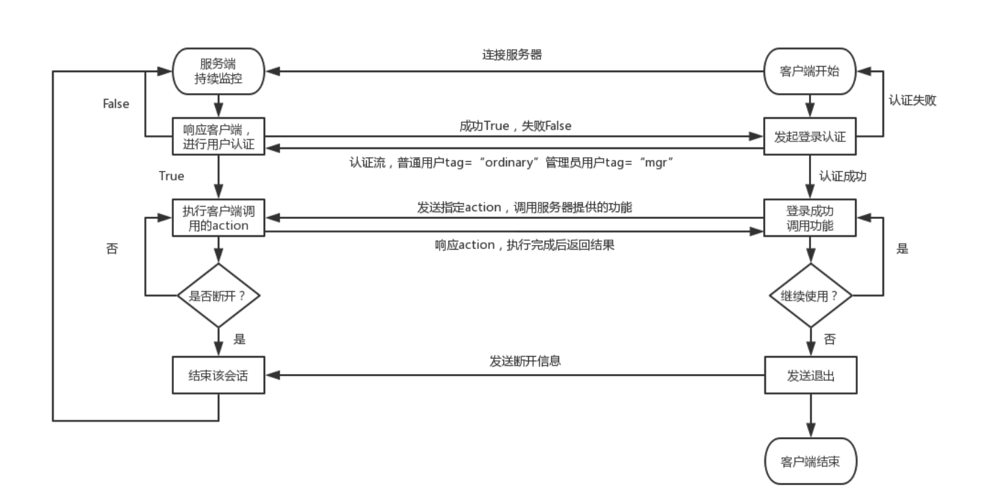
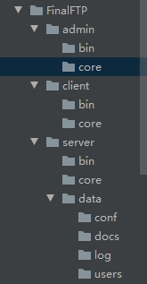

# FTP作业

## 作业要求

1. 用户加密认证
2. 允许同时多用户登录
3. 每个用户有自己的家目录 ，且只能访问自己的家目录
4. 对用户进行磁盘配额，每个用户的可用空间不同
5. 允许用户在ftp server上随意切换目录
6. 允许用户查看当前目录下文件
7. 允许上传和下载文件，保证文件一致性
8. 文件传输过程中显示进度条
9. 可以删除文件
10. 附加功能：支持文件的断点续传

## FTP流程图



## 目录结构



## 服务器端

服务器端主要是处于长期运行监控状态。在调用启动之后，即无需再次操作。

**bin文件夹**：主要是放置的服务器启动文件，运行该文件夹下的 start.py 即可启动服务器

```python
import os
import sys
import socketserver
base_path = os.path.dirname(os.path.dirname(os.path.abspath(__file__)))
sys.path.append(base_path)


from data.conf.configure import Host,Port
from core.heart import MyTCPHandler

if __name__ == '__main__':
    try:
        server = socketserver.ThreadingTCPServer((Host, Port), MyTCPHandler)
        print("Server is Running".center(50, "-"))
        print("Server地址：%s，端口号：%s".center(32, " ") % (Host, Port))
        server.serve_forever()
    except:
        print("当前server所需端口已被占用,请检查！")
```

**core文件夹**：主要存放服务器程序的核心部分，涉及文件的作用如下：

- heart.py  主要是服务器与终端的连接方式设定，内部设有相应功能模块


- record.py  此文件是设定的服务器log日志显示和存储的形式

```python
import logging

def record(filename):
    # 1.创建一个logger对象
    logger = logging.getLogger() #创建一个logger对象
    logger.setLevel(logging.INFO)

    # 2.创建一个屏幕管理操作符
    sh = logging.StreamHandler()
    sh.setLevel(logging.INFO)

    # 3.创建一个文件管理操作符
    fh = logging.FileHandler(filename)
    fh.setLevel(logging.INFO)

    # 4.创建一个日志输出格式
    formater = logging.Formatter('%(asctime)s - %(levelname)s - %(message)s')

    #5.操作符绑定日志格式
    sh.setFormatter(formater)
    fh.setFormatter(formater)

    # 6.绑定文件和屏幕管理操作符
    logger.addHandler(sh)
    logger.addHandler(fh)

    return logger
```

**data文件夹**：主要是存放数据，涉及的文件夹和文件作用如下：

**conf文件夹：**存放configure.py文件，此文件作用是默认参数配置.此处存放有当前服务器监控的地址和端口，可更改此处来实现实际需要。另一个较为重要的是管理员的账号和密码，此程序暂不支持更改管理员账号和密码，但管理员账号和密码是由管理员程序使用的，普通用户程序使用无效。

**docs文件夹：**此文件夹主要存放的是客户上传到服务器的文件，存放的原则是按照用户名来创建相应的文件夹。

**log文件夹**：此文件夹下存放的是系统日志，系统运行之后会按照日期生成对应的日志文件，文件名形式为：年-月-日.txt

**users文件夹**：此文件夹下存在两个文件，一个是Quota.txt，存放的是用户当前允许使用的配额。一个是UserAuth.txt，存放的是注册用户的信息。

## 客户端

 客户端部分涉及到的是MiniClient，此文件夹下主要是有Bin和Core两个文件夹组成。

Bin文件夹下放置程序开始的文件Start.py；Core文件夹下放置程序的核心文件CCore.py

功能：

## 管理端

管理端部分涉及到的是MiniAdmin，此文件夹下主要是有Bin和Core两个文件夹组成。

Bin文件夹下放置程序开始的文件start.py；

```python
import os
import sys
base_dir = os.path.dirname(os.path.dirname(os.path.abspath(__file__)))
sys.path.append(base_dir)

from core.acore import Manager

if __name__ == '__main__':
    StartLink = Manager()
    StartLink.link_server()
```

Core文件夹下放置程序的核心文件acore.py

1、 注册用户

可注册允许登录ZFTP的普通用户账号

2、 删除用户

可删除当前已存在的普通用户账号

3、 查看用户

可查看当前已存在的普通用户账号。

4、 修改配额

可修改注册用户的空间配额值

5、 退出

退出系统

```python
import re
import os
import json
import socket
import hashlib

pattern = re.compile("^(25[0-5]|2[0-4]\d|[0-1]?\d?\d)(\.(25[0-5]|2[0-4]\d|[0-1]?\d?\d)){3}$")

class Manager:

    '''
    # 连接服务器
    '''
    def link_server(self):
        c = 0 # 作为计数器，统计登录次数
        while True:
            print("欢迎登录FinalFTP管理系统".center(50, '-'))
            self.server_ip = input("服务器地址:")
            if self.server_ip == "":
                print("服务器地址不能为空，请重新填写")
                continue
            elif pattern.match(self.server_ip):
                self.server_port = input("服务端口:")
                if self.server_port == "":
                    print("服务器端口不能为空，请重新填写")
                    continue
                elif self.server_port.isdigit():
                    while True:
                        auth_res = self.__AuthenticationName() # 用户认证
                        if auth_res.get('standcode') == 100:
                            self.sock.close()
                            c = c + 1
                            if c>= 3:
                                print("累次错误三次，程序退出")
                                exit()
                else:
                    print("服务端口必须为数字，请重新填写")
            else:
                print("服务器格式必须为IPv4地址，请重新填写。")
                continue

    '''
    # 登录服务器，服务器端认证用户名和密码
    '''
    def __AuthenticationName(self):
        self.sock = socket.socket()
        self.sock.connect((self.server_ip, int(self.server_port)))
        print("寻找服务器成功".center(50,"-"))
        self.username=input("管理员账号:")
        password = input("密码:")
        crypto_password = hashlib.md5(password.encode('utf-8'))
        ##########此处是用来获取本机当前正在使用的地址####################
        # ipaddr = [a for a in os.popen('route print').readlines() if ' 0.0.0.0 ' in a][0].split()[-2]
        ipaddr = [a for a in os.popen('ipconfig').readlines() if 'IPv4 地址' in a][0].split(':')[1].split()[0]
        ##################################################################
        auth_msg = {
            'type':'auth',
            'ipaddr':ipaddr,
            'username':self.username,
            'password':crypto_password.hexdigest(),
            'auth_tag':'mgr'
        }
        self.sock.send(json.dumps(auth_msg).encode('utf-8'))
        rec_msg = self.__recvmsg()
        if rec_msg.get('standcode') == 101:
            print(rec_msg.get('standmsg'))
            print(('%s, 欢迎进入FinalFTP管理界面' %self.username).center(50,'-'))
            self.__Admin_manager()
        elif rec_msg.get('standcode') == 102 or rec_msg.get('standcode') == 100:
            return rec_msg
        else:
            return rec_msg

    '''
    # 从服务起端接收消息
    '''
    def __recvmsg(self):
        data = self.sock.recv(1024)
        data = json.loads(data.decode('utf-8'))
        return data

    '''
    # 管理员登录成功后，展示操作界面
    '''
    def __Admin_manager(self):
        while True:
            msg = self.__recvmsg()
            if msg.get('data') is not None:
                msg_data = msg.get('data')

                while True:
                    print(msg_data)
                    select = input("请选择:")
                    if select != "":
                        self.sock.send(json.dumps(select).encode('utf-8'))
                        ret_slt = self.__recvmsg()
                        # 添加用户
                        if ret_slt.get("standcode") == 400:
                            self.__admin_add()
                            break
                        # 删除用户
                        elif ret_slt.get("standcode") == 405:
                            self.__admin_delete()
                            break

                        # 退出系统
                        elif ret_slt.get("standcode") == 406:
                            self.__admin_exit()
                            break
                        # 查看当前存在的用户
                        elif ret_slt.get("standcode") == 407:
                            self.__skmsg(ret_slt)
                            break
                        # 修改配额
                        elif ret_slt.get("standcode") == 410:
                            self.__cgmsg()
                            break
                        elif ret_slt.get("standcode") == 102:
                            continue
                    else:
                        continue

    def __admin_add(self):
        reg_user=input("注册的用户名：").strip()
        reg_passwd=input("注册的密码:").strip()
        reg_passwd=(hashlib.md5(reg_passwd.encode("utf-8"))).hexdigest()
        ret_msg={
            "username":reg_user,
            "password":reg_passwd,
            "quotavalue":"30"
        }
        self.sock.send(json.dumps(ret_msg).encode())
        tag=self.__recvmsg()
        print(str(tag.get("standcode"))+":"+tag.get("standmsg"))


    def __admin_delete(self):
        del_name=input("要删除的用户名：")
        self.sock.send(json.dumps(del_name).encode())
        tag=self.__recvmsg()
        print(str(tag.get("standcode"))+":"+tag.get("standmsg"))


    def __skmsg(self,ret_slt):
        seek_list=ret_slt.get("data")
        if seek_list is not None:
            if len(seek_list)!=0:
                for item in seek_list:
                    try:
                        skuser,skvalue=item.strip("\n").strip('"').split(":")
                        print("用户名：%s，当前服务器空间限额：%sM"%(skuser,skvalue))
                    except:
                        break
        else:
            print("当前尚未存在用户")
    def __cgmsg(self):
        while True:
            qtname=input("用户名:")
            qtvalue=input("修改后的配额值：")
            if qtvalue.isdigit():
                qtmsg={
                    "name":qtname,
                    "value":qtvalue
                }
                self.sock.send(json.dumps(qtmsg).encode())
                qt_res=self.__recvmsg()
                if qt_res.get("standcode")==411:
                    print("修改成功！")
                    break
                else:
                    print("修改失败！")
                    break
            else:
                print("输入的配额值必须是数字！")
    def __admin_exit(self):
        self.sock.shutdown(2)
        self.sock.close()
        print("欢迎使用，再见".center(50,"-"))
        exit()
```


 

目前不支持管理员更改自身的用户名和密码。


