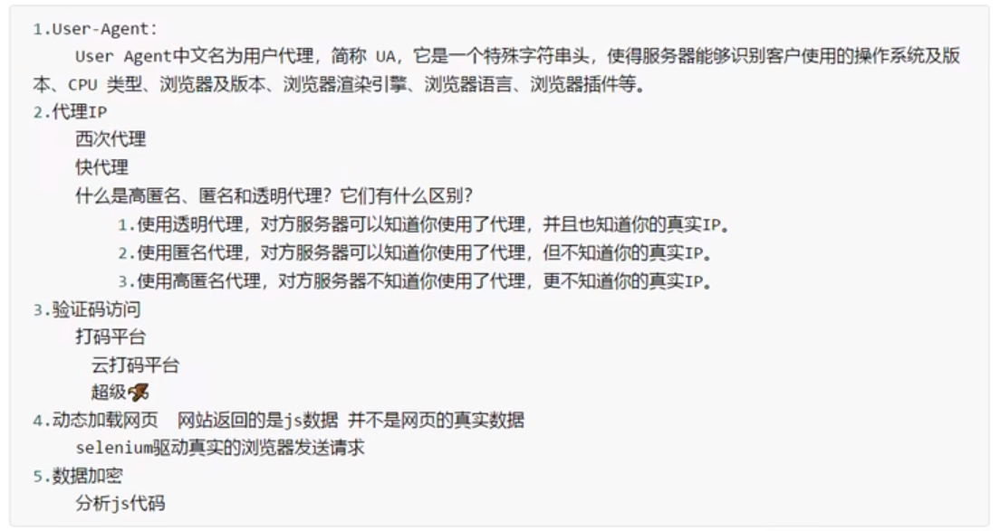

## 一、概念

1. 什么是互联网爬虫
   - 解释1：通过一个程序，根据Url(http://www.taobao.com)进行爬取网页，获取有用信息
   - 解释2：使用程序模拟浏览器，去向服务器发送请求，获取响应信息
2. 爬虫的核心
   - 1.爬取网页：爬取整个网页 包含了网页中所有得内容
   - 2.解析数据：将网页中你得到的数据 进行解析
   - 3.难点：爬虫和反爬虫之间的博弈
3. 爬虫的用途
   - 数据分析/人工数据集
   - 社交软件冷启动
   - 舆情监控
   - 竞争对手监控

4. 爬虫的分类


5. 反爬手段

   

## 写爬虫的思路

1. 给一个url
2.  写程序，模拟浏览器访问url
3.  解析内容，提取数据

## 涉及到的知识点

1. 使用到的库:
       urllib/requests/bs4
2. 解析网页内容的知识
       正则表达式, bs4, xpath, jsonpath
3. 设计到动态 html
       selenium+phantomjs, chromeheadless
4. scrapy 框架
       高性能框架使用
5. scrapy-redis 组件
       redis, 分布式爬虫
6. 设计到爬虫-反爬虫-反反爬虫的一些内容
       UA, 代理， 验证码， 动态页面等

## http 和 https 协议

```
参考链接：https://www.cnblogs.com/wqhwe/p/5407468.html
    超文本传输协议HTTP协议被用于在Web浏览器和网站服务器之间传递信息，HTTP协议以明文方式发送内容，不提供任何方式的数据加密，
如果攻击者截取了Web浏览器和网站服务器之间的传输报文，就可以直接读懂其中的信息，因此，HTTP协议不适合传输一些敏感信息，比如：信用卡号、密码等支付信息。
　　     为了解决HTTP协议的这一缺陷，需要使用另一种协议：安全套接字层超文本传输协议HTTPS，为了数据传输的安全，HTTPS在HTTP的基础上加入了SSL协议，
SSL依靠证书来验证服务器的身份，并为浏览器和服务器之间的通信加密.
    http(端口号80) 是应用层协议 https(端口号443)
    客户端在使用HTTPS方式与Web服务器通信时有以下几个步骤，如图所示。
　　（1）客户使用https的URL访问Web服务器，要求与Web服务器建立SSL连接。
　　（2）Web服务器收到客户端请求后，会将网站的证书信息（证书中包含公钥）传送一份给客户端。
　　（3）客户端的浏览器与Web服务器开始协商SSL连接的安全等级，也就是信息加密的等级。
　　（4）客户端的浏览器根据双方同意的安全等级，建立会话密钥，然后利用网站的公钥将会话密钥加密，并传送给网站。
　　（5）Web服务器利用自己的私钥解密出会话密钥。
　　（6）Web服务器利用会话密钥加密与客户端之间的通信。

参考链接：https://www.cnblogs.com/10158wsj/p/6762848.html
一次HTTP操作称为一个事务，其工作过程可分为四步：
1）首先客户机与服务器需要建立连接。只要单击某个超级链接，HTTP的工作开始。
2）建立连接后，客户机发送一个请求给服务器，请求方式的格式为：统一资源标识符（URL）、协议版本号，后边是MIME信息包括请求修饰符、客户机信息和可能的内容。
3）服务器接到请求后，给予相应的响应信息，其格式为一个状态行，包括信息的协议版本号、一个成功或错误的代码，后边是MIME信息包括服务器信息、实体信息和可能的内容。
4）客户端接收服务器所返回的信息通过浏览器显示在用户的显示屏上，然后客户机与服务器断开连接。
如果在以上过程中的某一步出现错误，那么产生错误的信息将返回到客户端，有显示屏输出。对于用户来说，这些过程是由HTTP自己完成的，用户只要用鼠标点击，等待信息显示就可以了。
```

### HTTP请求中的常用消息头:

```
   accept:浏览器通过这个头告诉服务器，它所支持的数据类型
　　Accept-Charset: 浏览器通过这个头告诉服务器，它支持哪种字符集
　　Accept-Encoding：浏览器通过这个头告诉服务器，支持的压缩格式
　　Accept-Language：浏览器通过这个头告诉服务器，它的语言环境
　　Host：浏览器通过这个头告诉服务器，想访问哪台主机
　　If-Modified-Since: 浏览器通过这个头告诉服务器，缓存数据的时间
　　Referer：浏览器通过这个头告诉服务器，客户机是哪个页面来的  防盗链
　　Connection：浏览器通过这个头告诉服务器，请求完后是断开链接还是何持链接
   X-Requested-With: XMLHttpRequest, 通过ajax方式进行访问
```

### HTTP响应细节——常用响应头：

```
    Location: 服务器通过这个头，来告诉浏览器跳到哪里
　　Server：服务器通过这个头，告诉浏览器服务器的型号
　　Content-Encoding：服务器通过这个头，告诉浏览器，数据的压缩格式
　　Content-Length: 服务器通过这个头，告诉浏览器回送数据的长度
　　Content-Language: 服务器通过这个头，告诉浏览器语言环境
　　Content-Type：服务器通过这个头，告诉浏览器回送数据的类型
　　Refresh：服务器通过这个头，告诉浏览器定时刷新
　　Content-Disposition: 服务器通过这个头，告诉浏览器以下载方式打数据
　　Transfer-Encoding：服务器通过这个头，告诉浏览器数据是以分块方式回送的
　　Expires: -1  控制浏览器不要缓存
　　Cache-Control: no-cache
　　Pragma: no-cache
```

