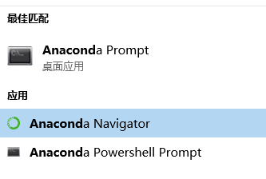
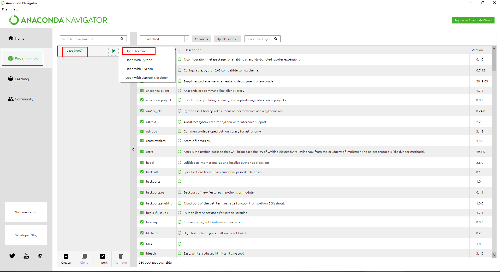
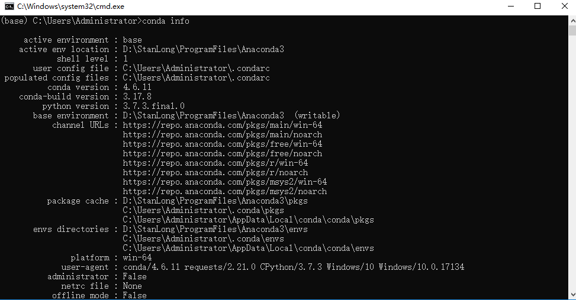
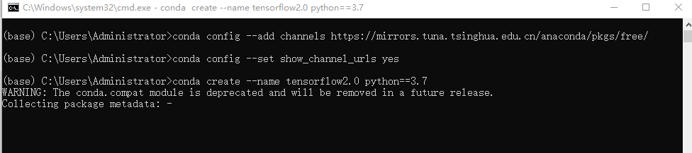
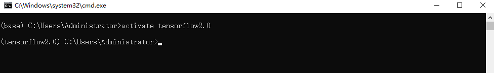
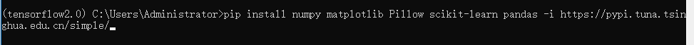
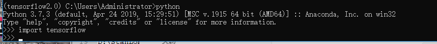

# 环境准备

## Anaconda

### 介绍

Anaconda是可以便捷获取包且对包能够进行管理，同时对环境可以统一管理的发行版本。Anaconda包含了conda、Python在内的超过180个科学包及其依赖项。

### 下载地址

https://mirrors.tuna.tsinghua.edu.cn/anaconda/archive/

使用版本 Anaconda3-2019.03-Windows-x86_64.exe

安装到windows上



选择 Anaconda Navigator图形界面



打开终端输入 conda info 查看环境信息



## Tensorflow2.0

### 介绍

TensorFlow是一个基于数据流编程（dataflow programming）的符号数学系统，被广泛应用于各类机器学习（machine learning）算法的编程实现。

### 安装

- 安装Tensorflow时，需要从Anaconda仓库中下载，这里用国内清华镜像


```shell
conda config --add channels https://mirrors.tuna.tsinghua.edu.cn/anaconda/pkgs/free/
conda config --set show_channel_urls yes
```

- 创建独立环境并激活

```shell
conda create --name tensorflow2.0 python==3.7.3
activate tensorflow2.0
```





- 安装相关软件包

```shell
pip install numpy==1.16.5 matplotlib Pillow scikit-learn pandas -i https://pypi.tuna.tsinghua.edu.cn/simple/
```



- 安装tensorflow2.0

```shell
pip install tensorflow==2.0.0-beta -i https://pypi.tuna.tsinghua.edu.cn/simple/
```


- import tensorflow 不报错就算是安装成功了



